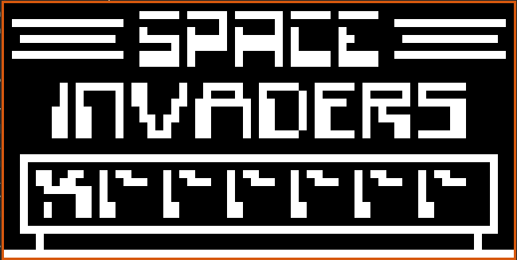
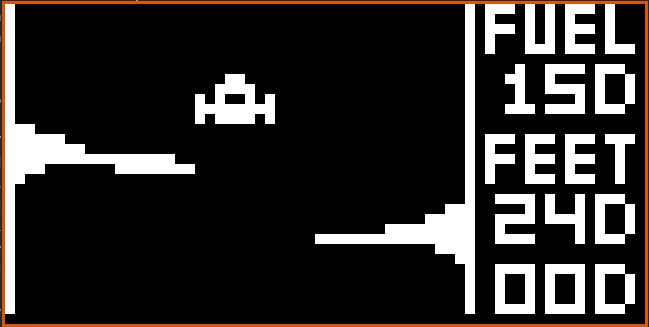
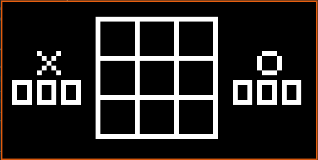

# CHIP-8 Emulator

A simple, functional CHIP-8 emulator written by me as a learning project. It supports most CHIP-8 programs.

> ⚠️ **Note**: This emulator does **not** support sound output.

---

## Screenshots

### Space Invaders


### Lunar Lander


### Tic Tac Toe


---

## Dependencies

This emulator uses [raylib](https://www.raylib.com/) for rendering. Make sure it's installed before building the project.

---

## How to Run

1. Clone the repository and build:

    ```bash
    git clone https://github.com/tmpstpdwn/CHIP-8
    cd CHIP-8
    make
    ```

2. Run the emulator with a ROM:

    ```bash
    ./chip8 path/to/rom.ch8
    ```

3. Keyboard controls:

    CHIP-8 uses a 4×4 hexadecimal keypad:

    ```
    1 2 3 C
    4 5 6 D
    7 8 9 E
    A 0 B F
    ```

    Mapped to your keyboard as:

    ```
    1 2 3 4
    Q W E R
    A S D F
    Z X C V
    ```

---

## ROMs

You can find public domain CHIP-8 ROMs [here](https://github.com/dmatlack/chip8/tree/master/roms).

---

## License

MIT License — free to use, modify, and distribute.

---

## Credits

- Based on [this tutorial](https://austinmorlan.com/posts/chip8_emulator/) by [Austin Morlan](https://austinmorlan.com/)
